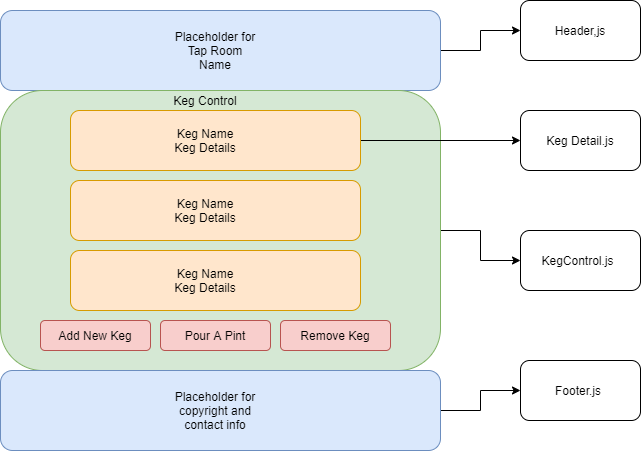

## Tap Room

#### By: Geoff Goetz | April 24th 2020

## Description 

This application will be a representation of a Tap-Room employee inventory tracking website. This project should allow an employee of the Tap-Room to add, monitor and track stock levels of products.

Application based around utilizing component trees, state, and CRUD functionality in React. [Deployed on GitHub pages]()

## Component Diagram

## Project Specifications

## Setup/Installation Requirements

#### Node install

##### For macOS:
_If Homebrew is not installed on your computer already, then install Homebrew by entering the following two commands in Terminal:_
* $ /usr/bin/ruby -e "$(curl -fsSL https://raw.githubusercontent.com/Homebrew/install/master/install)"
* $ echo 'export PATH=/usr/local/bin:$PATH' >> ~/.bash_profile

_Install Git with the following command:_
* $ brew install git

_Next, install Node.js by entering the following command in Terminal:_
* $ brew install node

##### For Windows:
_Please visit the [Node.js website](https://nodejs.org/en/download/) for installation instructions._

#### Install this application

_Clone this repository via Terminal using the following commands:_
* _$ cd desktop_
* _$ git clone {url to this repo}_
* _$ cd farmers-market_
_Then, confirm that you have navigated to the farmers-market project directory by entering "pwd" in Terminal._

_Next, install npm at the project's root directory via the following commands:_
* _$ npm install_
* _$ npm run build_

_Open the contents of the directory in a text editor or IDE of your choice (e.g., to open the contents of the directory in Visual Studio Code on macOS, enter the command "code ." in Terminal)._

## Known Bugs

_No known bugs at this time._

## Technologies Used

* Node.js
* Webpack
* npm
* Javascript
* jQuery
* React

### License

[MIT](https://choosealicense.com/licenses/mit/)

Copyright &copy; 2020 **_Geoff Goetz_**